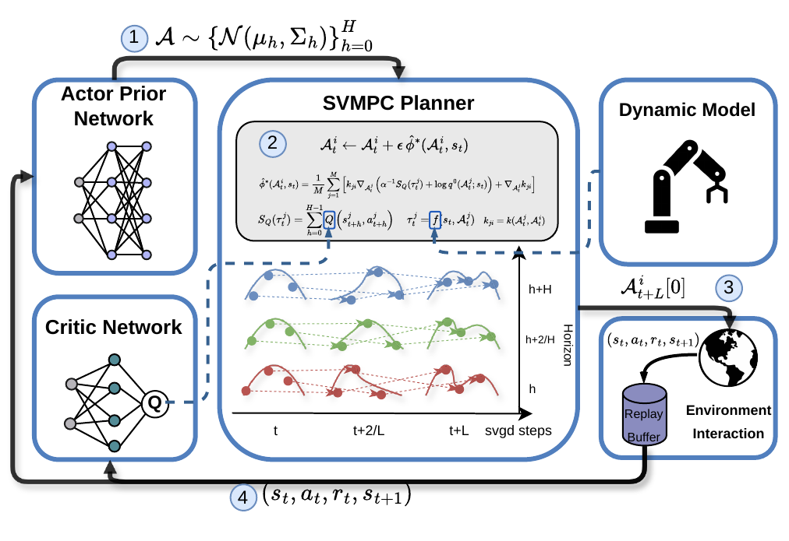

# Q-SVMPC

**Q-Guided Stein Variational Model Predictive Control via RL-informed Policy Prior**  
Shizhe Cai, Zeya Yin, Jayadeep Jacob, and Fabio Ramos  
Accepted to the **2026 IEEE/RSJ International Conference on Intelligent Robots and Systems (IROS 2026)**.

📄 **Paper:** [arXiv:2507.06625](https://arxiv.org/abs/2507.06625)

## Overview



Q-SVMPC is a learning-guided model predictive control method that treats trajectory planning as posterior inference. It samples candidate trajectories from a reinforcement-learning-informed policy prior, then refines them with Stein variational gradient descent (SVGD) using learned soft Q-values as guidance. This particle-based optimization is designed to preserve diverse, high-value trajectories without requiring a hand-designed task cost.

The paper evaluates Q-SVMPC on navigation, robotic manipulation, and a real-world fruit-picking task, reporting competitive learning efficiency, final performance, and training stability against MPC and reinforcement-learning baselines.

## Code

**Source code coming soon.**

## Citation

```bibtex
@inproceedings{cai2026qsvmpc,
  title     = {{Q-Guided Stein Variational Model Predictive Control via RL-informed Policy Prior}},
  author    = {Cai, Shizhe and Yin, Zeya and Jacob, Jayadeep and Ramos, Fabio},
  booktitle = {2026 IEEE/RSJ International Conference on Intelligent Robots and Systems (IROS)},
  year      = {2026}
}
```
